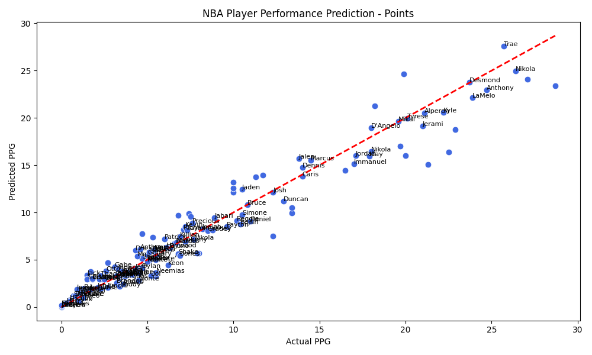

# NBA Performance Predictor 🏀


A machine learning project that predicts NBA player points per game (PPG) based on performance statistics using Random Forest and Linear Regression models.

## 📊 Project Overview

This project analyzes 2023-2024 NBA season data to predict player scoring performance with high accuracy (~95% R² score). The model uses key performance metrics like shooting percentages, rebounds, assists, and playing time to make predictions.

### Key Features

- 🎯 **Dual Model Approach**: Implements both Random Forest and Linear Regression for comparison
- 📈 **High Accuracy**: Achieves R² score of ~0.95+ with RMSE of 1-2 PPG
- 📉 **Visual Analysis**: Generates scatter plots comparing predicted vs actual values
- 🔍 **Feature Importance**: Analyzes which stats most impact scoring predictions

## 🚀 Getting Started

### Prerequisites

- Python 3.8 or higher
- pip package manager

### Installation

1. Clone the repository
```bash
git clone https://github.com/ziontop/nba-performance-predictor.git
cd nba-performance-predictor
```

2. Create a virtual environment (recommended)
```bash
python -m venv venv
source venv/bin/activate  # On Windows: venv\Scripts\activate
```

3. Install dependencies
```bash
pip install -r requirements.txt
```

4. Add your dataset
   - Download the [2023-2024 NBA Season Stats from Kaggle](https://www.kaggle.com/)
   - Place the CSV file in the project root directory (same folder as `nba_predictor.py`)
   - Update the filename in `nba_predictor.py` if needed (default: `nba_stats_2023-24.csv`)

### Usage

Run the predictor:
```bash
python nba_predictor.py
```

The script will:
1. Load and preprocess the NBA stats data
2. Train Random Forest and Linear Regression models
3. Display model performance metrics (R², RMSE, MAE)
4. Generate visualization plots showing prediction accuracy

## 📈 Model Performance

| Model | R² Score | RMSE | MAE |
|-------|----------|------|-----|
| Random Forest | ~0.95+ | 1-2 PPG | ~1 PPG |
| Linear Regression | ~0.90+ | 2-3 PPG | ~1.5 PPG |

## 📊 Sample Visualization


*Scatter plot showing predicted vs actual PPG with high correlation (R² ~0.95)*

## 🔢 Features Used

The model predicts PPG based on these statistics:

- **MP** - Minutes Played per game
- **FG%** - Field Goal Percentage
- **3P%** - Three-Point Percentage
- **FT%** - Free Throw Percentage
- **TRB** - Total Rebounds per game
- **AST** - Assists per game
- **STL** - Steals per game
- **BLK** - Blocks per game
- **TOV** - Turnovers per game

## 📁 Project Structure

```
nba-performance-predictor/
│
├── nba_predictor.py          # Main prediction script
├── requirements.txt          # Python dependencies
├── README.md                 # Project documentation
├── LICENSE                   # MIT License
├── .gitignore               # Git ignore rules
├── prediction_plot.png      # Sample visualization
│
└── nba_stats_2023-24.csv    # NBA data (add your CSV here)
```

## 🛠️ Technologies Used

- **Python 3.8+**: Core programming language
- **pandas**: Data manipulation and analysis
- **numpy**: Numerical computing
- **scikit-learn**: Machine learning models and evaluation
- **matplotlib**: Data visualization
- **seaborn**: Statistical data visualization

## 📊 Sample Output

```
Random Forest Model Performance:
R² Score: 0.9523
RMSE: 1.45 PPG
MAE: 0.98 PPG

Linear Regression Model Performance:
R² Score: 0.9124
RMSE: 2.13 PPG
MAE: 1.52 PPG

Top 3 Most Important Features:
1. Minutes Played (MP): 45.2%
2. Field Goal % (FG%): 23.8%
3. Assists (AST): 12.4%
```

## 🚧 Future Improvements

- [ ] Add more seasons of historical data for trend analysis
- [ ] Predict additional stats (rebounds, assists, steals)
- [ ] Deploy as an interactive web application (Flask/Streamlit)
- [ ] Include player position and team as features
- [ ] Implement hyperparameter tuning for optimal performance
- [ ] Add player injury history as a feature
- [ ] Create API endpoint for real-time predictions

## 🤝 Contributing

Contributions are welcome! Please feel free to submit a Pull Request. For major changes:

1. Fork the repository
2. Create your feature branch (`git checkout -b feature/AmazingFeature`)
3. Commit your changes (`git commit -m 'Add some AmazingFeature'`)
4. Push to the branch (`git push origin feature/AmazingFeature`)
5. Open a Pull Request

## 📝 License

This project is licensed under the MIT License - see the [LICENSE](LICENSE) file for details.

## 🙏 Acknowledgments

- NBA statistics data sourced from [Kaggle](https://www.kaggle.com/)
- Inspiration from sports analytics and machine learning communities
- scikit-learn documentation and examples

## 📧 Contact

**Zina Okoye** - [GitHub](https://github.com/ziontop)

Project Link: [https://github.com/ziontop/nba-performance-predictor](https://github.com/ziontop/nba-performance-predictor)

---

⭐ If you found this project helpful, please consider giving it a star!
